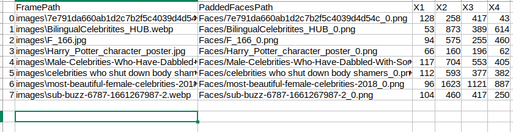
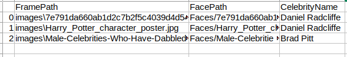
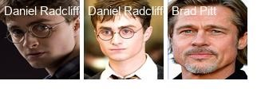

# Celebrity Identification
Identification of celebrities by extracting face and the passing that cropped face to the CLIP model.

### Quick Start

```
python identifyCelebrity.py --images_folder "images_folder"
```
### Details
* The celebrity lists are already saved in celebrityList.py file.
* If you want to add the names of additional celebrities or edit the file. You can always do that.

### Face Detection
The faces are detected using [retinaface](https://github.com/serengil/retinaface) model.

The output of the retinaface has been saved in following format


* X1, X2, X3 and X4 are the coordinates of the bounding boxes of the detected faces
* FrameFileName : Input image
* PaddedFacesPath : Extracted faces with some padding

### Celebrity Identification
The extracted faces are then pass to [CLIP](https://github.com/openai/CLIP) model with the list of celebrities to be detected.

The output of the model has been saved in following format


### Output

